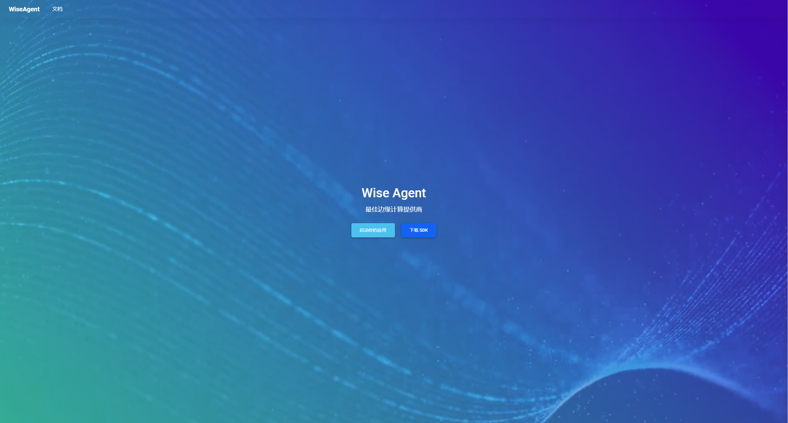
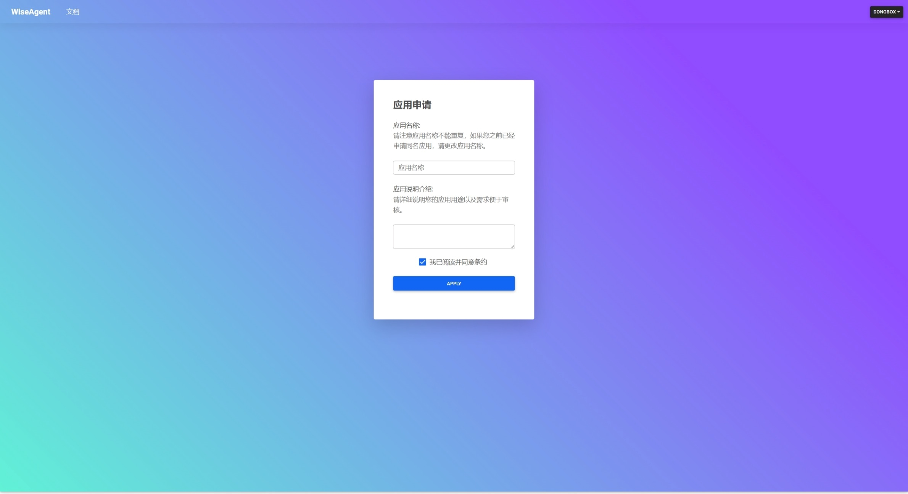

应用密钥
=============
## 如何获取APIKEY?
第三方网站如要使用WiseAgent必须要到官网进行申请并通过管理员审核后才能使用云端SDK。
在WiseAgent主页中点击“启动你的应用”进行登录。


登录后根据提示填写所创建应用的名称与介绍。

> 注意：用户自身不能存在同名应用，介绍愈完善愈便于审核。

申请通过后会获取到此应用的`APIKEY`，在接下来创建WiseAgent实例的时候传入APIKEY即可，SDK会自动将此APIKEY加入请求头进行验证。

## 使用样例
```
import os
# 获取APIKEY与WiseAgent服务地址
APIKEY = os.environ.get("APIKEY")
WiseMQServer = os.environ.get("WiseMQServer")
# 实例化WiseAgent交互对象
wisemq_interface = WiseMQInterface(APIKEY, WiseMQServer)
```
